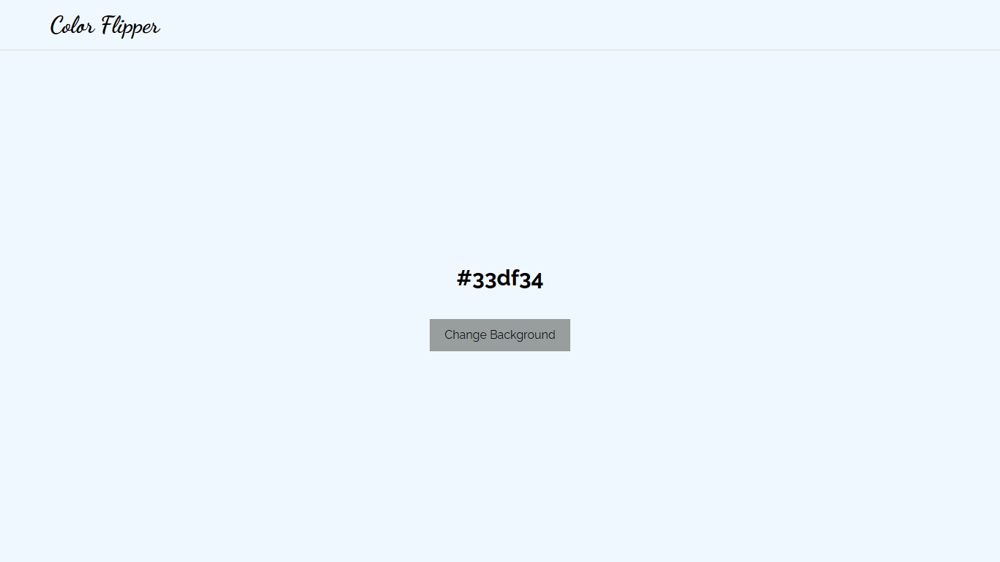
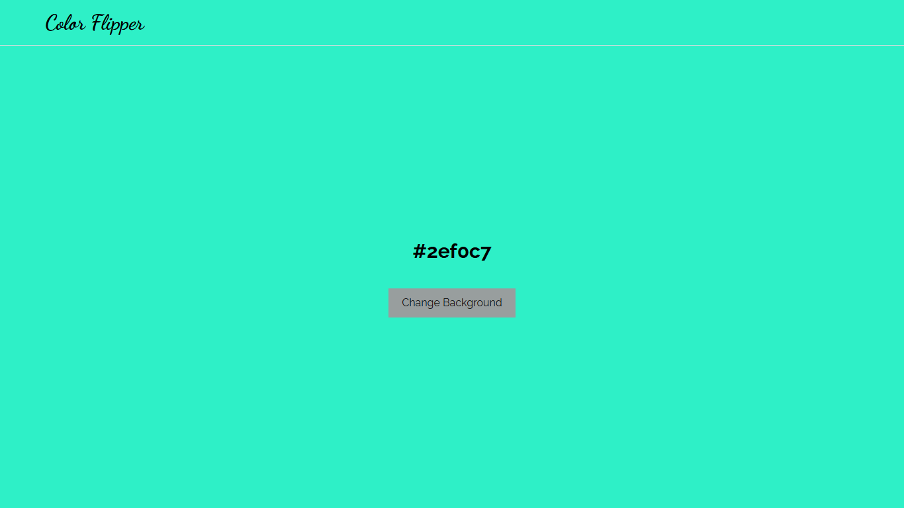
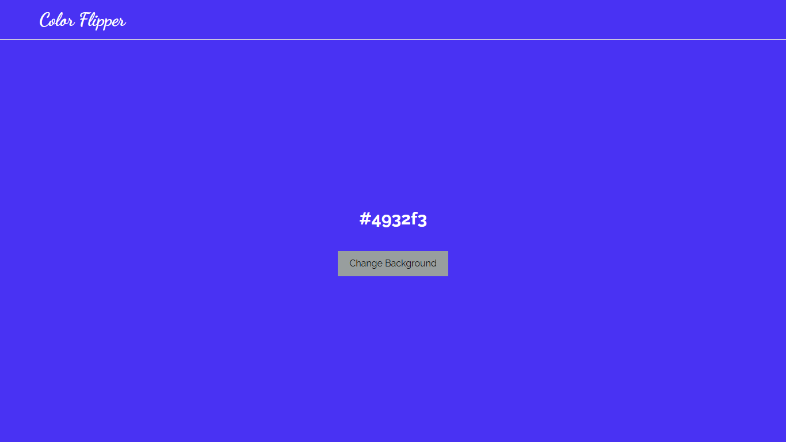

# Color Flipper

A simple, interactive web utility that generates a completely random background color on click and displays its corresponding hex code, automatically adjusting text contrast to maintain readability.

## Live Demo

[Insert Live Demo Link Here]

## Features

- **Random Generation:** Generates millions of possible 6-character Hex color codes dynamically.
- **Duplicate Prevention:** Uses a `do...while` loop to guarantee no identical color is ever generated twice in a row.
- **Adaptive Contrast:** Automatically calculates the mathematical brightness of the generated background color and adjusts the text to be either white or black.

## Screenshots





## Tech Stack

- **Frontend:** HTML5, CSS3, Vanilla JavaScript (ES6+)
- **Backend:** N/A
- **Database:** N/A
- **Other:** N/A

## Installation

```bash
git clone [https://github.com/ifeanyi234/Color-flipper.git](https://github.com/ifeanyi234/Color-flipper.git)
cd color-flipper
```

## Running Locally

Because this is a Vanilla JavaScript project without build tools, simply open index.html directly in any modern web browser.

## Known Limitations

- The colors are mathematically random, meaning it does not generate curated or specifically "aesthetic" color palettes.
- The contrast algorithm uses a simplified RGB average formula ($\frac{R+G+B}{3}$). While functional, it does not account for relative human eye sensitivity to different color wavelengths (e.g., pure green appears brighter to humans than pure blue).

## What I'd Improve With More Time

- Clipboard Integration: Add a "Copy to Clipboard" button next to the hex code for easier usability.
- Format Toggle: Allow the user to switch the display format between Hex, RGB, and HSL modes.
- History Log: Add a sidebar that tracks the last 5 generated colors so users can return to a previous color they liked.
